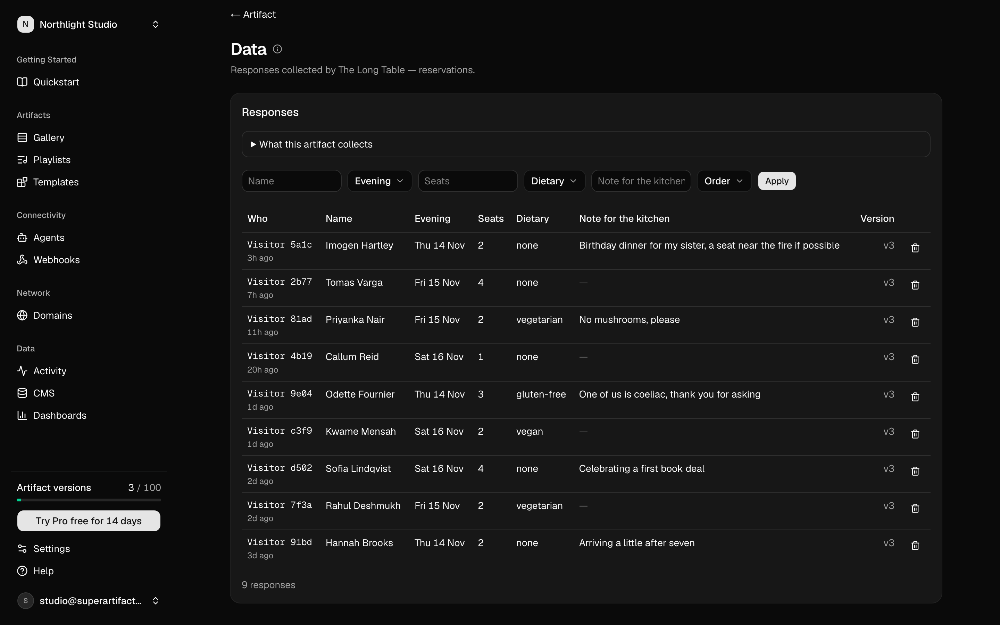
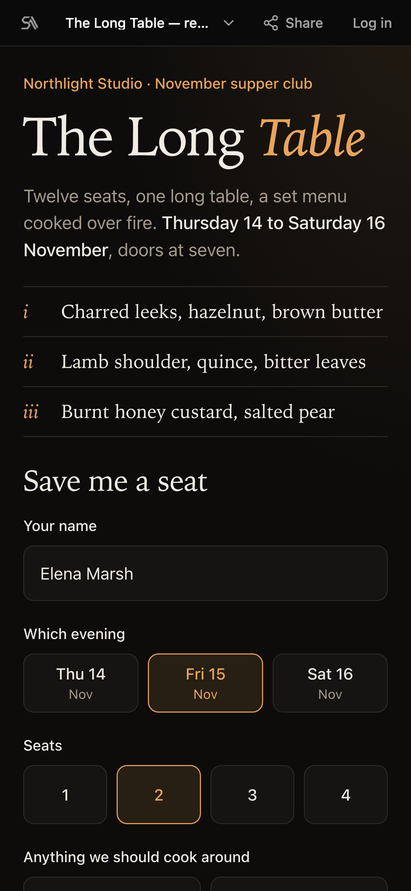
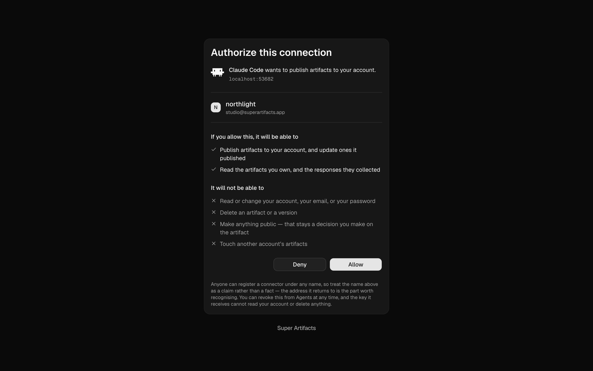

<!--
  This file is the ROOT README of github.com/Super-Artifacts/plugins, a mirror.
  It lives at plugins/marketplace/README.md in the private repo and is copied to
  the public repo's root by .github/workflows/plugin-marketplace.yml, and
  plugins/marketplace/assets/ is copied to the public assets/. Every relative
  path below (assets/..., super-artifacts/docs/...) is relative to the PUBLIC
  repo root, not to this file's home. The
  plugin-marketplace check assembles the tree the way the workflow does and
  fails when any of them does not resolve there.
-->
<p align="center">
  <picture>
    <source media="(prefers-color-scheme: dark)" srcset="assets/brand/logo-on-dark.svg">
    <source media="(prefers-color-scheme: light)" srcset="assets/brand/logo-on-light.svg">
    
  </picture>
</p>

<h3 align="center">An agent builds it. Somebody opens it.</h3>

<p align="center">
  <a href="https://superartifacts.app">superartifacts.app</a> ·
  <a href="https://superartifacts.app/docs">Docs</a> ·
  <a href="https://superartifacts.app/pricing">Pricing</a> ·
  <a href="super-artifacts/docs/connect/README.md">Connect your agent</a>
</p>

---

Super Artifacts is where the things your coding agent builds go to be opened. An agent publishes a page, a form, a tracker or a walkthrough, and gets back a live URL that works on a phone. Visitors can answer what you built, and your agent reads the answers back and can change the page, all through the same connection.

This repository is the public side of it: the MCP endpoint to point your agent at, the guides for each agent, and the Claude Code plugin.

## What it does

- **It is data-driven.** An artifact can declare what it collects. Visitors' answers land in a hosted database, and the agent that published it reads them back, as rows or as totals.
- **It works across agents.** Any agent that can talk to an MCP server connects to one URL and signs in through your browser. There is a guide for each one, [linked below](#connect-in-30-seconds).
- **Templates save tokens.** When someone has already built the thing you want, your agent installs that template and fills it in instead of writing it again from nothing.
- **Playlists group artifacts.** Put artifacts in an order, or let a rule fill the list, and present them one at a time from a single link.

## Connect in 30 seconds

The MCP endpoint is the same for every agent, and it signs in over OAuth:

```text
https://api.superart.page/mcp
```

In Claude Code it is one command:

```bash
claude mcp add --transport http super-artifacts https://api.superart.page/mcp
```

Your browser then opens a consent page that names the account the agent would publish to. Allow it only if it is yours. Connecting publishes nothing, and the key can be revoked from your agents page.

For any other agent, follow its own page. Each one lists the exact line that agent takes:

[Claude Code](super-artifacts/docs/connect/claude-code.md) ·
[Claude Desktop and claude.ai](super-artifacts/docs/connect/claude-desktop-claude-ai.md) ·
[ChatGPT](super-artifacts/docs/connect/chatgpt.md) ·
[Codex](super-artifacts/docs/connect/codex.md) ·
[Cursor](super-artifacts/docs/connect/cursor.md) ·
[Windsurf](super-artifacts/docs/connect/windsurf.md) ·
[Zed](super-artifacts/docs/connect/zed.md) ·
[Gemini CLI](super-artifacts/docs/connect/gemini-cli.md) ·
[GitHub Copilot](super-artifacts/docs/connect/github-copilot.md) ·
[Devin](super-artifacts/docs/connect/devin.md) ·
[Hermes](super-artifacts/docs/connect/hermes.md) ·
[OpenClaw](super-artifacts/docs/connect/openclaw.md)

## What it looks like

<p align="center">
  
  <br>
  <sub>The answers visitors left on a published page, in the dashboard. They are the same rows your agent reads back with <code>super_data</code>. (Demo data.)</sub>
</p>

<p align="center">
  
  <br>
  <sub>What somebody opens: a published page at its own URL, on a phone. (Demo data.)</sub>
</p>

<p align="center">
  
  <br>
  <sub>Connecting names the account first and lists what the key can and cannot do.</sub>
</p>

## The sixteen tools

Your agent gets these over MCP. One noun each, and `super_help` returns short usage notes on demand.

| Tool | What it is for |
| --- | --- |
| `super_publish` | Publish an artifact at a stable URL. The same slug makes a new version. |
| `super_artifacts` | List your artifacts, their versions and their files. |
| `super_artifact_set` | Change what an artifact serves and to whom: version, live, visibility, collection, delete. |
| `super_data` | Read what visitors submitted. |
| `super_data_query` | Aggregate what was collected. |
| `super_data_schema` | See what data exists and what it means. |
| `super_entries` | Read or write a collection's entries. |
| `super_templates` | Find, list and read templates. |
| `super_template_save` | Create or revise a template draft. |
| `super_template_action` | Install, uninstall, rate, report or roll back a template. |
| `super_release_template` | Make one version of your template available to everyone who installed it. |
| `super_playlist` | Create, read and edit playlists. |
| `super_share` | Give people access. |
| `super_comments` | Read and answer the comments on an artifact. |
| `super_whoami` | Show which account and agent this connection publishes as. |
| `super_help` | How the tools fit together. |

## Claude Code plugin

On top of the MCP connection, the plugin adds slash commands to Claude Code. You ask your agent for proof that a change works, and instead of "all tests pass" and a 40-file diff, you run:

```text
/proof
```

You get one short video per key change, chaptered, at a URL that plays inline on a phone. Captions are burned in, each beat is seekable, and a comment box under it writes into a hosted database so a reviewer can reply to the thing on screen.

Install it from this repository, as two separate prompts:

```text
/plugin marketplace add Super-Artifacts/plugins
```

```text
/plugin install super-artifacts@super-artifacts
```

Updates install themselves: a git-hosted marketplace auto-updates in the background.

| Command | What it does |
|---------|--------------|
| `/connect` | Connect over OAuth. A consent screen opens in the browser and the key is stored locally (mode 600). |
| `/disconnect` | Revoke this machine's key, then remove the local copy. |
| `/init` | A getting-started artifact tailored to your CLI tool. |
| `/doctor` | Can this machine record and publish? It checks by connecting, never by reading config. |
| `/proof` | Record this session's change and publish it. |
| `/proof-demo` | Prove the whole chain works, against a bundled page. |

**Pairing never builds anything.** The plugin connects; it does not spend your inference tokens until you invoke a command. Artifacts are private until you make them openable, which is a decision you take on the artifact's own page.

What the plugin needs on your machine (Playwright, a full ffmpeg), the two recording tiers and how it publishes are in [its README](super-artifacts/README.md).

## Status

The hosted product is live at [superartifacts.app](https://superartifacts.app). This repository is a read-only mirror of the plugin and its connect guides, regenerated from the private source repository on every change to them, so commits made here are overwritten. The Claude Code plugin is at the version in [`plugin.json`](super-artifacts/.claude-plugin/plugin.json).

<!-- LICENSE: pending owner decision -->
